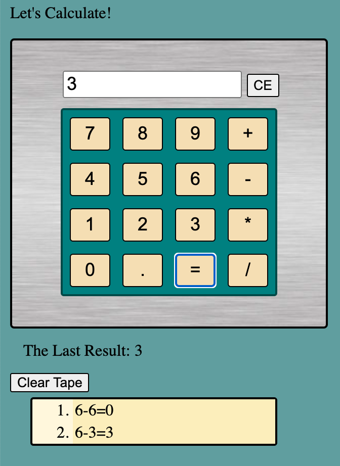

<!--  -->

# JQuery Serverside Calculator Project

## Description

_Duration: Weekend Sprint_

This application allows you to perform simple math operations in a web browser.  It features fixed keyboard, and running calculator tape.  At any time, users can select a tape line to repeat that calculation.

To see the fully functional site, please visit: [DEPLOYED VERSION OF APP](https://www.JamesDBird.me)

## Screen Shot

`

## Installation

requires server.js to run in NodeJS.  Use "npm Start" script to start server.  Default is port 5000.   

## Usage
Press calculator buttons which will function like a physical calculator.  The goal was to have it look, act like a physical calculator, thus can not type in the 'LCD' screen.  If one of two number are not entered, calculator will assume zero.

## Built With

JQuery
HTML
NodeJS
Express
JavaScript

## Acknowledgement
Thanks to [Prime Digital Academy](www.primeacademy.io) who equipped and helped me to make this application a reality.  Vatti Rocks!

## Support
If you have suggestions or issues, please contact me at www.JamesDBird.com